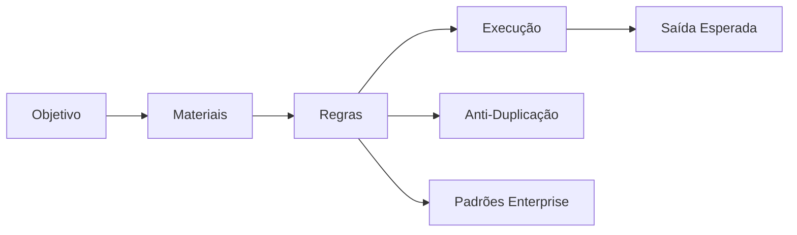

## Skill Graph

## Contexto
- **Agente-alvo**: {{TARGET_AGENT}}
- **Domínio**: {{DOMAIN}}
- **Autonomia**: {{AUTONOMY_LEVEL}}
- **Restrições**: {{CONSTRAINTS}}

## Objetivo
{{HIGH_LEVEL_DESCRIPTION}}

## Materiais → [[Materiais]]
{{MATERIALS_TABLE}}

## Regras de Economia de Tokens → [[Token Economy]]
1. Progressive disclosure: corpo mínimo; detalhes em seções âncora.
2. Wikilinks `[[Seção]]` para referenciar sem repetir conteúdo.
3. Linguagem imperativa e telegráfica; sem meta-comentário.
4. Tabelas para 3+ itens comparáveis; bullets apenas para sequências.
5. Máximo 1 exemplo por regra, somente quando necessário.
6. Referencie caminhos de arquivo; não copie conteúdo.
7. Frontmatter enxuto: só `name`, `description`, `version`.
8. Defina escopo de parada: não expanda além do objetivo.
9. Constraints como negativos explícitos: "NÃO faça X".
10. Elimine redundâncias; nunca duplique bloco já definido.

## Protocolo Anti-Duplicação → [[Anti-Duplicação]]
1. Leia `IMPLEMENTATION_LOG.md` antes de qualquer implementação.
2. Busque equivalente no código-base (grep semântico por nome/responsabilidade).
3. Se existir: reutilize ou estenda — **nunca duplique**.
4. Diff mínimo: menor mudança que resolve; não reescreva arquivos inteiros.
5. Avalie consistência com nomenclatura, arquitetura e testes do projeto.
6. Registre ao final: data, resumo e arquivos tocados em `IMPLEMENTATION_LOG.md`.
7. **Nunca gere código morto** ou implementações por precaução.

## Padrões Enterprise → [[Padrões Enterprise]]
- Preservar separação de camadas (domínio / aplicação / infraestrutura).
- Nomenclatura consistente e autoexplicativa.
- Testes automatizados para nova lógica de negócio.
- Tratamento de erro explícito; proibir `except: pass` ou catch silencioso.
- Documentação mínima viável: README e docstrings públicas atualizados.
- Logs estruturados em produção; sem `print` solto.
- Segurança básica: nunca commitar segredos; validar toda entrada externa.

## Modo Incremental → [[Incremental]]
Diff de materiais para atualização incremental:
{{INCREMENTAL_DIFF}}

## Execução
- Produza artefato no formato nativo do agente-alvo.
- Inclua instruções de uso curtas e acionáveis.
- **Pare** quando objetivo e artefatos solicitados forem entregues.
- Nível de autonomia `{{AUTONOMY_LEVEL}}`: respeite escopo definido.

## Saída Esperada
- Um artefato por agente-alvo, no formato e caminho nativos.
- `IMPLEMENTATION_LOG.md` atualizado após execução.
- Prompt sugerido de ativação da skill (1–3 frases).
